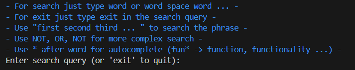
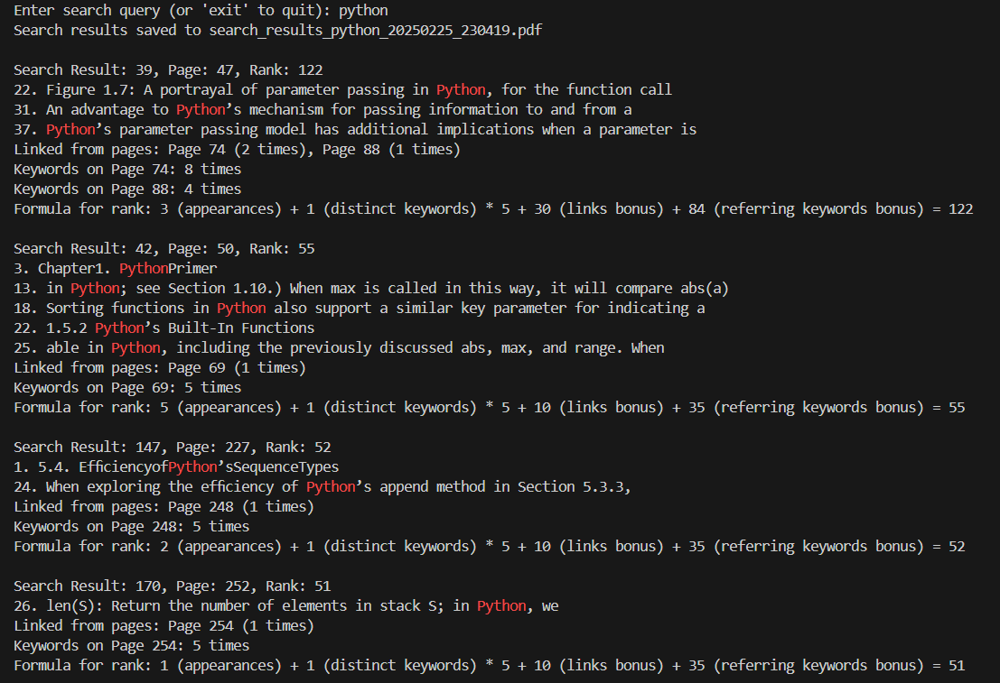
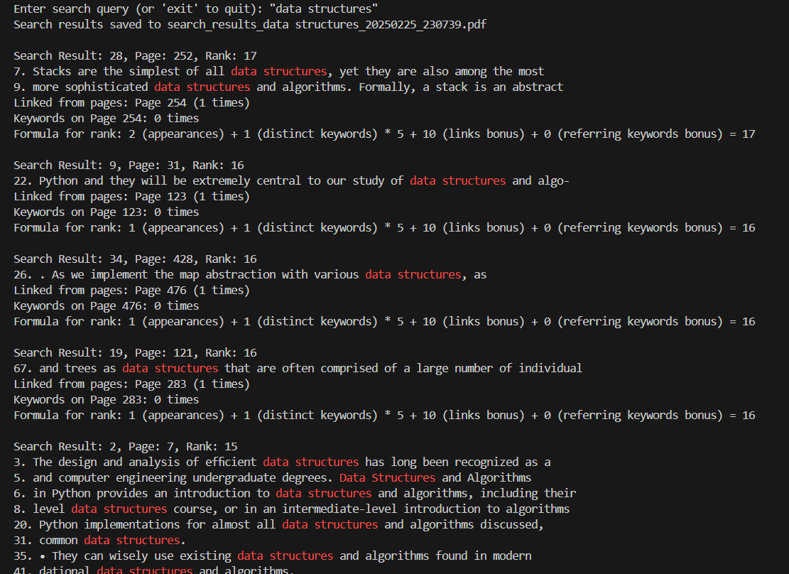
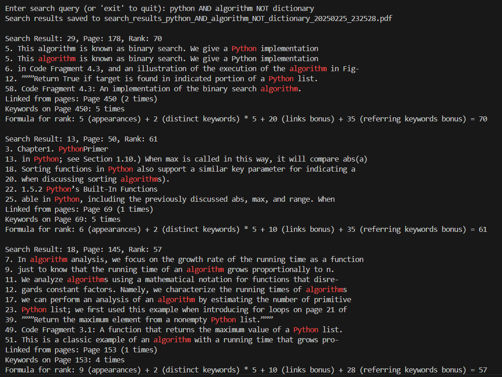
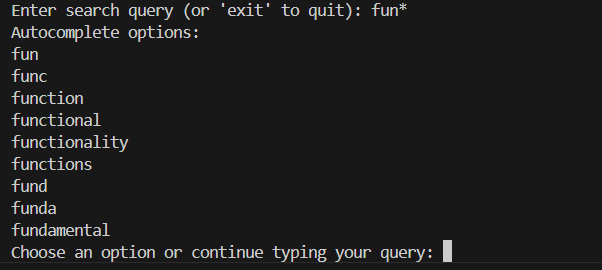

# 📄 PDF Search Engine  

🔍 **PDF Search Engine** is a Python-based search engine that processes a single PDF document, builds optimized data structures, and enables efficient keyword-based search. Users can enter textual queries, and the system ranks and displays relevant search results.  

The project uses **Data Structures and Algorithms in Python** as a test document.  

---

## 🚀 Features
✔️ **Pre-indexing:** The system processes the PDF upon startup, extracting and structuring the text for fast retrieval.  
✔️ **Ranked Search Results:** Results are ranked based on keyword occurrences and additional ranking heuristics.  
✔️ **Multi-Word Queries:** Users can enter one or more words separated by spaces, and results will be ranked accordingly.  
✔️ **Logical Operators:** Supports `AND`, `OR`, and `NOT` for complex queries (e.g., `python AND algorithm NOT dictionary`).  
✔️ **Pagination:** Displays a limited number of results per page, with options to view more.  
✔️ **Graph-Based Ranking:** Page references (`See page X`) improve the ranking of linked pages.  
✔️ **Trie-Based Indexing:** Efficient word search using a trie data structure.  
✔️ **Auto-Complete & Suggestions:** Provides query completion and "Did you mean?" suggestions for misspelled words.  
✔️ **PDF Export & Highlighting:** Saves search results as a separate PDF file with highlighted keywords.  

---

## 🛠 Technologies & Dependencies
| Library       | Purpose |
|--------------|---------|
| `pdfminer.six`  | Extract text from PDF files |
| `PyPDF2`        | Read and write PDF documents |
| `networkx`      | Build a graph of page references |
| `collections`   | Optimized data structures (e.g., `defaultdict`) |
| `difflib`       | Find similar words (for auto-correction) |
| `re`            | Process regular expressions for query parsing |
| `pickle`        | Serialize and load pre-indexed search structures |

Install dependencies using:
```sh
pip install pdfminer.six PyPDF2 networkx
```
---

## 📚 Table of Contents
- [🚀 Features](#-features)  
- [🛠 Technologies & Dependencies](#-technologies--dependencies)  
- [📖 How It Works](#-how-it-works)  
- [🔧 Installation & Usage](#-installation--usage)  
- [📌 Example Search Result](#-example-search-result)
  - [🔍 Base Search](#-base-search)  
  - [🔎 Phrase Search](#-phrase-search)  
  - [🔎 Logical Search](#-logical-search)  
  - [🔎 Autocomplete](#-autocomplete)
- [📂 Search Results & Pagination](#-search-results--pagination)
- [⚠️ Potential Issues and Troubleshooting](#potential-issues)   
- [📜 License](#-license)  
- [📬 Contact](#-contact) 

---

## 📖 How It Works
1. **Preprocessing:**  
   - The script parses the PDF file, extracts text from each page, and constructs data structures.  
   - A **graph** is built from references like `"See page 45"`, improving search rankings.  
   - A **trie** is constructed for fast word searching.  
   - Indexed data is serialized for faster subsequent searches.  

2. **Search Execution:**  
   - Users input a search query (single or multiple words).  
   - The program processes the query using **logical operators** if provided.  
   - Results are ranked based on occurrences, graph connectivity, and additional heuristics.  

3. **Displaying Results:**  
   - The top results are shown with **page numbers and contextual snippets** where the word appears.  
   - **Pagination** allows users to navigate through results.  
   - Users can save results as a **PDF with highlighted keywords**.  

---

## 🔧 Installation & Usage

### **1️⃣ Clone the Repository**
```sh
git clone https://github.com/your-username/pdf-search-engine.git
cd pdf-search-engine
```

### **2️⃣ Install Dependencies Manually**  
Run the following command to install required Python libraries:  
```sh
pip install pdfminer.six PyPDF2 networkx
```

### **3️⃣ Run the Search Engine**  
To start the search engine, run the following command:  
```sh
python main.py
```

### **4️⃣ Enter Your Search Query**  
Example queries:  
```sh
data structures
algorithm OR graph
python NOT dictionary
```
---
## 📌 Example Search Result  

When you start the **PDF Search Engine**, the following menu appears, guiding you through different search options:  

### 🛠 **Available Search Options:**  
- **Basic search:** Type a single word or multiple words separated by spaces to search for occurrences in the document.  
- **Exit:** Type `exit` in the search query to close the program.  
- **Phrase search:** Use double quotes (`"word1 word2 word3"`) to search for an exact phrase in the document.  
- **Logical search:** Use `NOT`, `OR`, and `AND` to perform advanced queries (e.g., `python AND algorithm NOT dictionary`).  
- **Autocomplete:** Add `*` at the end of a word to get suggestions (e.g., `fun*` → `function, functionality`).  

Below is an example of how the search menu looks when you start the application:  

  

---

### 🔍 **Base Search**  
After entering a search query, the system scans the document and displays ranked results.  

#### **How ranking works:**  
- **Keyword appearances**: More occurrences = higher rank.  
- **Distinct keywords bonus**: More unique keywords = better ranking.  
- **Page references (links bonus)**: If another page references the current one, it increases rank.  
- **Referring keywords bonus**: If a keyword appears on multiple linked pages, it adds extra points.  

Below is an example of a basic search query:  

  

---

### 🔎 **Phrase Search**  
Phrase search allows users to look for an exact sequence of words by enclosing them in double quotes (`"`).  

#### **Example:**  
If you search for:  
```sh
"data structures"
```

The system will only return results where `"data structures"` appears exactly as written, rather than separate occurrences of `"data"` and `"structures"` on the same page. This ensures that the search retrieves only results where the words appear together in the correct order.  

Below is an example of phrase search results:  

  

### 🔎 **Logical Search**  
Logical search allows users to refine their queries using logical operators:  

- **`AND`** – Returns results that contain **both** words.  
- **`OR`** – Returns results that contain **at least one** of the words.  
- **`NOT`** – Excludes pages containing the specified word.  

#### **Example Query:**  
```sh
python AND algorithm NOT dictionary
```
- This query will return results that **contain both** `"python"` and `"algorithm"`, but **exclude** any pages that mention `"dictionary"`.  

Below is an example of a logical search result:  

  

### 🔎 **Autocomplete**  
The search engine provides **autocomplete suggestions** when a user types a word followed by `*`. This helps in quickly finding relevant terms without typing the full word.  

#### **How It Works:**  
- Type the beginning of a word followed by `*` (e.g., `fun*`).  
- The system will display **a list of possible completions**.  
- You can select an option or continue typing your query.  

#### **Example Query:**  
```sh
fun*
```
The system suggests words like:
```sh
fun
func
function
functional
functionality
functions
fund
funda
fundamental
```

Below is an example of the autocomplete feature in action:



---

## 📂 **Search Results & Pagination**  
- The program ranks and displays **the top 20 search results** based on relevance.  
- Search results are **automatically saved as a PDF file**, named according to the query (e.g., `search_results_python_20250225_230419.pdf`).  
- In the generated PDF, **keywords are automatically highlighted**, making it easier to spot relevant matches.  
- After viewing 20 results, the user is prompted with three options:  
  - **`next`** → View the next 20 results.  
  - **`all`** → Display all remaining results at once.  
  - **`done`** → Exit the search.

---

<a name="potential-issues"></a>

## ⚠️ Potential Issues and Troubleshooting  

| Issue | Solution |
|-------|----------|
| `ModuleNotFoundError: No module named 'pdfminer'` | Run `pip install pdfminer.six` to install the missing library. |
| `ModuleNotFoundError: No module named 'PyPDF2'` | Run `pip install PyPDF2` to install the missing library. |
| `ModuleNotFoundError: No module named 'networkx'` | Run `pip install networkx` to install the missing library. |
| `PDF file not found` | **Make sure to update the path to your PDF file in the script before running the program.** |
| `Slow search performance` | Try running with pre-indexed data using `pickle` serialization. |
| `UnicodeDecodeError` when processing PDF | Ensure the PDF file is properly encoded and not corrupted. |
| `Graph ranking does not work as expected` | Verify that the script correctly extracts page references (e.g., "See page X"). |

**🔹 Required Dependencies:**  
Before running the script, make sure you have installed all required dependencies:  
```sh
pip install pdfminer.six PyPDF2 networkx difflib
```  

---

## 📜 License  
This project is licensed under the [MIT License](LICENSE.md).  
See the LICENSE file for more details.  

---

## 🔗 Useful Links  

- 📖 [README](README.md)  
- ❤️ [Code of Conduct](CODE_OF_CONDUCT.md)  
- 📜 [MIT License](LICENSE.md)  

---

## 📬 Contact  
📧 **Email:** [milansazdov@gmail.com](mailto:milansazdov@gmail.com)  
🐙 **GitHub:** [MilanSazdov](https://github.com/MilanSazdov)  

---
